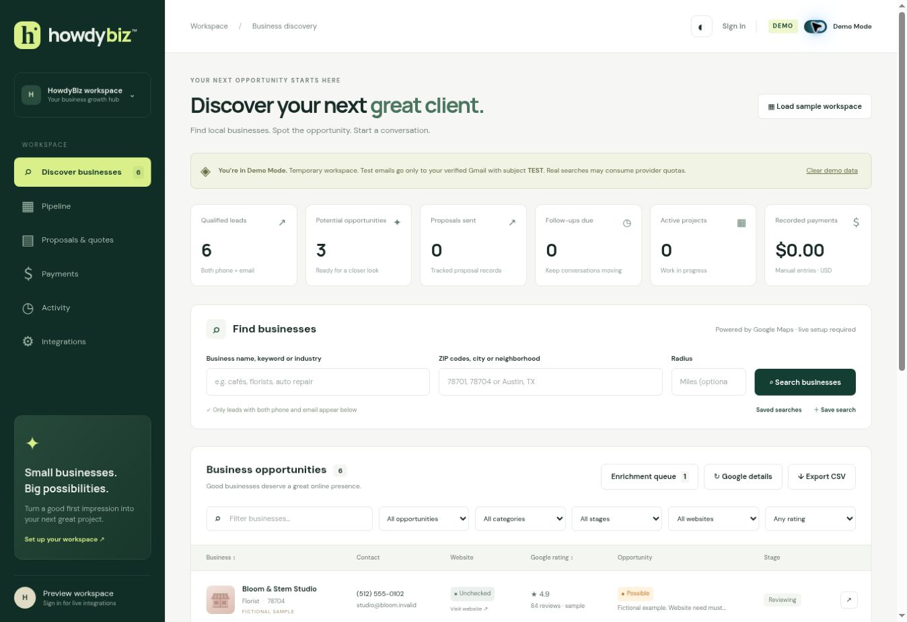

# HowdyBiz

Business discovery and outreach CRM with a static GitHub Pages frontend and a Supabase backend. The first visit starts in Demo Mode. The deployable frontend has no production npm dependencies.

## Current delivery status

- Frontend and dedicated Supabase backend are deployed; production records are private and owner-scoped.
- **Default integration: connected ChatGPT worker.** No Google Cloud API keys or Gmail OAuth client setup are required for this route.
- Business searches and explicitly reviewed Send requests enter a secure queue in Supabase. An enabled ChatGPT automation checks **hourly**, using the owner's existing Gmail/Supabase connections and public web search. Requests can also be processed immediately by asking this conversation: **Process my pending HowdyBiz requests now.**
- The owner's Supabase email confirmation and sign-in session were verified. Sign in in the dashboard with the configured owner email and follow the secure link when needed. Sign-in persists across browser tabs until sign-out; existing tabs update automatically after the secure link opens. Search opens the sign-in dialog when authentication is required.
- A real public-web verification search completed and stored one sourced demo lead. A real unsent Gmail draft was created; no outreach or test email was sent.
- **36 automated tests passed.** The scheduled worker connected successfully and checked the queue. No approved emails were waiting; provider sending acceptance remains unverified.
- `football-squares` remains paused. No paid upgrade was performed.

## Easiest workflow

1. Open https://1nfected92.github.io/howdybiz/ and sign in with the workspace owner email.
2. Leave Demo Mode ON while testing. Enter a keyword and ZIP/city and click Search.
3. Open **Requests** for queued/running/completed/error status. Automatic processing is hourly; use the run-now instruction above when needed.
4. Complete-contact leads appear in the dashboard; incomplete contacts stay in the enrichment queue. Inspect the cited public source and Analyze the website before outreach.
5. Prepare an email, review the actual recipient/body/subject, and explicitly click **Send**. This approves the frozen message for the connected worker, rather than sending it immediately.
6. Demo sends use only the verified connected Gmail address, exactly `TEST`, and no CC/BCC. Switching mode cancels waiting requests; an in-flight or unknown send blocks mode changes until resolved.
7. Importing a demo lead into production remains explicit. Live Send uses the saved business contact, and the worker records Gmail acceptance only with a real provider message ID.

**Coverage:** public web results are partial and independently sourced; they are not Google Places API results. Google ratings, Google photos, exhaustive listings and exact radius coverage are not included without evidence/configured providers. Unverified radius searches must report the limitation rather than silently widening the search.

**Availability:** the worker needs the owner's ChatGPT automation plus connected Gmail and Supabase accounts to remain enabled. Revoking a connection or disabling the automation stops processing; the queue remains visible and waiting requests can be cancelled. The app cannot export or reuse ChatGPT Gmail credentials in its static frontend.

### Worker maintenance

`supabase/connector-queue.sql` is the additive connector schema, mirrored in the CLI-generated migration. It provides service-only claim/finish RPCs; browser roles cannot write jobs or impersonate a worker. Owner/Gmail identity configuration lives only in private backend records. Never commit that configuration or tokens.

To pause processing, disable the **Process HowdyBiz requests** automation. To prevent new submissions as well, set `private.connector_config.enabled=false` through an authorized backend operation. Do not alter unrelated automations or Supabase projects.

## Local review

```bash
npm ci
npm test
npm run dev
```

Open http://localhost:4173/howdybiz/ and click **Load sample workspace**. The seven fictional records use reserved `.invalid` emails; six have both contacts and one goes to the enrichment queue. None are real Google results. Sample illustrations are not Google photos.

`HowdyBiz-Preview.html` is a self-contained interface preview. Open it in a browser to test notes, pipeline changes, drafts, quotes, manual payments, filters, themes and demo clearing. It begins with fictional samples. Backend features remain disabled until configured and authorized.

```bash
npm run build
npm run preview
npm run portable
```

All frontend assets use relative paths. Navigation is in-app and works under `/howdybiz/`. The build also writes a Pages 404 fallback.

## GitHub repository and Pages

The public repository and free GitHub Pages project site are deployed:

- Repository: https://github.com/1nfected92/howdybiz
- App: https://1nfected92.github.io/howdybiz/
- Initial successful deployment: https://github.com/1nfected92/howdybiz/actions/runs/36830700979

Open the app and click **Load sample workspace** to review the interface without configuring a backend. Samples are fictional. Sign in for connected-worker searches and approved email requests. Google credentials are required only for the optional direct API route.

To work locally:

```bash
git clone https://github.com/1nfected92/howdybiz.git
cd howdybiz
npm ci
npm test
npm run dev
```

Push changes to `main` to run the existing deployment workflow. Pages is configured to use **GitHub Actions** as its publishing source.

The workflow runs `npm ci`, all unit and PostgreSQL tests, builds `dist`, uploads the Pages artifact, and deploys. Set these repository **Actions variables**, which contain public values only:

- `HOWDY_SUPABASE_URL`: new HowdyBiz project API URL.
- `HOWDY_SUPABASE_PUBLISHABLE_KEY`: its publishable key, or legacy anon key.

Alternatively, set those public values in `public/config.json`. Never place a service-role key there. Browser Integrations settings offer a local public-configuration override.

## Dedicated Supabase backend

The dedicated backend has been provisioned at **$0/month**:

- Project ref: `jmofyaleyhhylmxenqme`
- API URL: `https://jmofyaleyhhylmxenqme.supabase.co`
- Region: `us-east-1`
- Initial migration: `howdybiz_initial`, applied successfully.
- Edge Function: `api`, active with explicit request authentication.
- Auth Site URL and redirect allowlist: `https://1nfected92.github.io/howdybiz/`
- Server-only values configured: `APP_URL`, `OWNER_EMAIL`, `GMAIL_TOKEN_KEY`.
- Frontend `public/config.json` contains only the project URL and publishable key.

The owner authorized pausing `football-squares` to make room. Its database was not deleted. Resuming it while both HowdyBiz and The Soleful Goddess are active may require more project capacity. Do not resume, pause or upgrade projects without the owner's direction.

Open HowdyBiz and **Sign in** with the configured owner's Gmail address, then follow the sign-in email. The connected-worker route is configured. The optional immediate API route needs the Google credentials described below. Do not reapply the bootstrap migration to this deployed database.

The CLI-generated migration in `supabase/migrations/` contains the canonical `supabase/schema.sql`. For a fresh project:

```bash
supabase login
supabase link
supabase db push
supabase functions deploy api --no-verify-jwt
```

`supabase link` prompts for the intended project. Inspect the selected ref before pushing. This bootstrap must run only on a fresh HowdyBiz project; its `CREATE TABLE` operations are intentionally not destructive replacements.

Auth setup:

1. Set the Supabase Auth Site URL to the deployed HowdyBiz URL.
2. Add that exact URL to the redirect allowlist. Add the localhost review URL separately if needed.
3. Enable email sign-in links. Configure SMTP for dependable production authentication delivery; the default provider has restrictive limits.
4. Set `OWNER_EMAIL` to the owner's verified Gmail address. Only that confirmed Auth user passes the API's authorization check.
5. Enable the Data API for `public`. The migration explicitly grants authenticated SELECT access and enables ownership RLS. Anonymous users have no CRM table access, and ordinary authenticated users cannot write or call privileged RPCs.
6. Sign in through the app. Creating an Auth account alone grants no access to the owner's records.

The function reads the built-in `SUPABASE_PUBLISHABLE_KEYS` and `SUPABASE_SECRET_KEYS` dictionaries, with legacy fallback. Secret keys are sent on `apikey`, never as bearer JWTs. Backend secrets are configured in Supabase Edge Functions → Secrets; keep their values out of source and chat. Add the remaining Google secrets individually, or use a private file containing only values you intend to update:

```bash
supabase secrets set --env-file .env
```

`GMAIL_TOKEN_KEY` is already generated and stored. Keep it stable; do not overwrite it when adding Google credentials. For a separate fresh project, generate it once. Rotating it requires reconnecting Gmail:

```bash
node -e "process.stdout.write(require('node:crypto').randomBytes(32).toString('base64'))"
```

The OAuth callback is public, so gateway `verify_jwt` is false. Every POST action explicitly verifies the Auth JWT via `/auth/v1/user`, confirmed email, the owner allowlist, and browser origin. OAuth callbacks use expiring, single-use server-side state and verify that the authorized Google account matches the workspace owner. Database RPCs are `SECURITY INVOKER`, have an empty search path, and are executable only by `service_role`.

## Google Cloud discovery

Create a Google Cloud project and enable **Places API (New)**. Enable **Geocoding API** if radius searches are used. Add an API-restricted key as `GOOGLE_PLACES_KEY` in backend secrets. A Maps billing account may be required; searches and photos can incur provider charges, including in Demo Mode. Set quotas and budgets before enabling live searches.

Discovery uses Text Search, explicit field masks, pagination, up to five zones per request, and four concurrent contact checks. For multiple cities/neighborhoods, separate zones with semicolons; comma-separated five-digit ZIP codes are accepted. Radius searches use a geocoded center and a distance filter. Google coverage and page limits mean searches are not exhaustive.

Google data does not provide business emails through this adapter. Emails are extracted from public website HTML and a same-origin contact/about page. No email guessing, CAPTCHA bypass, or Google HTML scraping is implemented. Sites that block automation or rely on JavaScript may require manual contact enrichment. A listed email is not a deliverability guarantee.

Google Maps listing names, addresses, categories, ratings, review counts and photos are transient. The backend stores place IDs, independently sourced contact facts, and user-authored CRM data. Production names use a public website's title/site name where available; otherwise a place-ID label is used. Independently sourced phone and email are required for a durable qualified lead. The dashboard can fetch a current Google listing on demand from a saved place ID using **Google details** for the current page or **Refresh Google listing** in its detail panel. Exports omit transient Google content, including phone numbers found only in Google listings.

Google photographs are fetched on demand, with Google Maps and author attribution. Confirm applicable Google Maps terms before extending storage, caching, bulk exporting, or data reuse. No storage rights are assumed.

## Optional immediate Gmail runtime authorization

The Gmail connector in this conversation cannot export its authorization to the deployed app. Configure a separate web OAuth client in Google Cloud and enable Gmail API. Google Cloud returned “Site Unavailable” in this browser, including one reload; client creation could not be completed here.

1. Configure an OAuth consent screen and add the owner as a test user if the app remains in testing.
2. Add the exact callback `https://jmofyaleyhhylmxenqme.supabase.co/functions/v1/api` as an authorized redirect URI.
3. Store `GOOGLE_CLIENT_ID` and `GOOGLE_CLIENT_SECRET` only in Edge Function secrets.
4. `APP_URL`, `OWNER_EMAIL` and the encryption key are already configured. Keep these values intact.
5. Sign in to HowdyBiz, open Integrations, click **Connect my Gmail**, and complete Google consent.

Scopes: `openid`, `email`, and `https://www.googleapis.com/auth/gmail.send`. The backend encrypts refresh tokens with AES-GCM, stores them in a private schema, and obtains access tokens server-side. OAuth testing status may affect refresh-token lifetime. Wider distribution may require Google verification. The Gmail connection can be revoked from Integrations.

Send-only authorization does not support reading replies, Gmail draft synchronization or open tracking. Drafts are stored in the CRM. Follow-ups and Do Not Contact updates are manual. A Gmail accepted message ID is recorded; delivery and opens are never claimed.

## Demo and send safeguards

- New workspaces start in Demo Mode. The toggle is at the upper right; switching to Live requires confirmation.
- Demo businesses, notes, quotes, manual payments and saved searches live in session storage. Server previews use separate demo rows that expire from workspace visibility after 24 hours.
- Live data is never loaded into the demo result list or metrics. Explicit import is available only for non-sample discoveries and preserves existing production CRM history.
- Email previews are frozen server-side for five minutes. The server reads authoritative mode/revision and saved contacts; it does not trust client recipients or client mode flags.
- In Demo Mode, To is the verified owner's Gmail, subject is exactly `TEST`, and no CC/BCC headers are generated. The body includes the intended business and original subject. Missing Gmail verification blocks sending.
- The send button redeems a single-use ticket. PostgreSQL locks workspace mode, ticket and business, then rechecks mode, ownership, contact, Do Not Contact and demo routing. Repeated identical submissions are blocked.
- Mode changes invalidate previews and cannot proceed during an active or unresolved send. Search writes/imports also check mode revision in a locked database operation.
- A timeout after attempting Gmail submission is `unknown`. The app never automatically retries it. Check Gmail Sent and resolve the issue manually in Integrations before retrying or changing mode. Resolution is labeled as manual, not provider confirmation.
- Clear Demo Data is blocked while a demo send is active/unknown. Expired server rows can be deleted by an administrator; visibility expiry does not automatically purge all stored bytes.
- There is no timer-driven page refresh. User-entered text persists across theme changes; background photo requests update only their preview region.

## CRM behavior

Opportunity: Potential, Possible or Not Needed, with a reason. HTTP availability alone does not establish website quality or buying intent. Website analysis checks reachability and reports limited HTML evidence; it is not a full accessibility or security audit.

Pipeline: New, Reviewing, Qualified, Email Drafted, Contacted, Proposal Sent, Follow-up, Negotiating, Accepted, In Progress, Completed, Not Interested, On Hold and Do Not Contact.

Quotes are versioned with scope, deliverables, timeline, USD amount, status, due date, payment terms and related-document URLs. Saving or setting a quote to Sent does not email it. Payment records are manual accounting entries; the app does not charge cards or confirm processor transactions.

## Verification and limitations

See `VERIFICATION.md` for executed checks and external blockers. Run the actual hosted integration checks after deployment:

1. Owner sign-in and outsider denial.
2. Real Places search in Demo, result coverage report and contact enrichment.
3. Review a TEST preview, explicitly send it, and confirm recipient/subject in Gmail Sent and the inbox.
4. Tamper with frontend To/CC/BCC/mode fields and confirm backend routing still uses authoritative settings.
5. Prepare a preview, switch modes, and confirm the old ticket is rejected.
6. Save a live note/proposal/payment, reload, and verify persistence.
7. Confirm Google photo attribution and listing refresh on desktop/mobile.
8. Inspect Supabase security advisors and RLS as a separate user.
9. Repeat the Pages smoke check after integration configuration; initial publication is verified.

The optional `scripts/ui-check.mjs` uses Playwright. Supply `HOWDY_PLAYWRIGHT_MODULE` and `HOWDY_CHROMIUM_PATH` for installed tooling, or install Playwright in a separate development environment. It exercises the compiled site and the standalone preview without connecting external accounts. Screenshots are written to `test-results/` and are not deployed.

Reference documentation:

- https://supabase.com/docs/guides/functions/auth
- https://supabase.com/docs/guides/database/postgres/row-level-security
- https://developers.google.com/maps/documentation/places/web-service/text-search
- https://developers.google.com/maps/documentation/places/web-service/policies
- https://developers.google.com/workspace/gmail/api/reference/rest/v1/users.messages/send
- https://developers.google.com/workspace/gmail/api/auth/web-server

## Published dashboard

This screenshot shows the deployed dashboard with fictional sample records.


